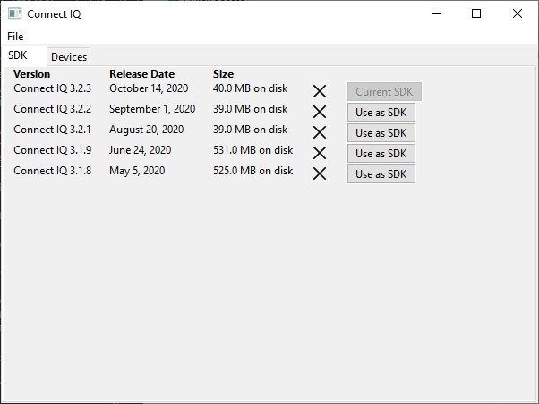
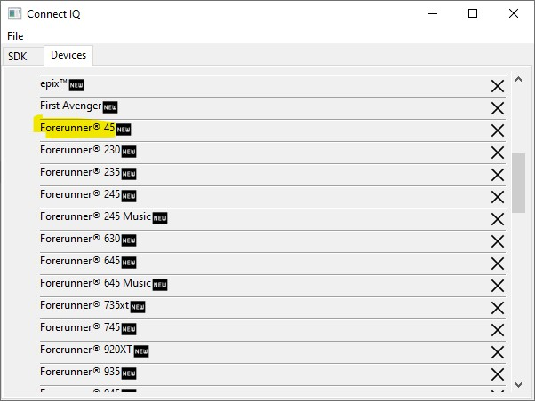
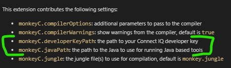
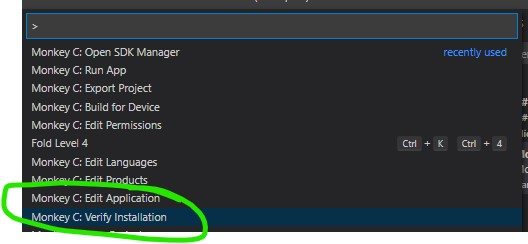
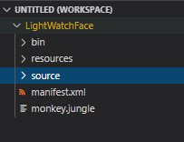
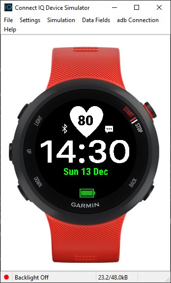

# Clear Forerunner 45 Watch Face
I have a [Garmin](http://www.garmin.com) watch which I use for running and other sports. It's a [Forerunner 45S](https://buy.garmin.com/en-GB/GB/p/682416) and while that's one of their more basic models I've had it for almost a year now and I really like it and find it very useful.

I've tended to customise the display (or "Watch Face") on the device since day 1 and Garmin has [an online store](https://apps.garmin.com/en-GB/devices/fenix3/appTypes/watchface/apps) where you can download different faces.

Some of those look very cool but not so many are compatible with the Forerunner 45 and [this one](https://apps.garmin.com/en-US/apps/eaa32b01-2868-4620-93f6-1e689bc5c75a) has been the one that I've been using for a long time as it's been most compatible with what I want (i.e. simplicity) on my watch face.

I decided recently though that I'd try building my own watch face and this repository contains the results of doing so. Firstly, a few notes on how I went about it.

# Getting Started Writing Watch Faces

I'm an old-school C/C++ programmer who's also done a lot with C# and .NET and lots of other bits of technology over time and so when it came to building a Garmin watch face I took a few steps.

## Registering on developer.garmin.com

I found that I didn't need to take much in the way of additional steps on the Garmin site in order to register as an app developer - I simply logged in using the credentials that I already had for garmin.com and it seemed to work fine.

## Getting Development Tools

The [basic guidance for building watch faces](https://developer.garmin.com/connect-iq/sdk/) starts with getting the SDK and so I went ahead and did that and I fairly quick found that it installs this SDK Manager tool;

and I went with the latest SDK that was available and on the Devices tab I made sure that I'd selected my Forerunner 45;

I also made sure that I'd gone out and installed the [Java runtime](https://www.java.com/en/) which I haven't had on a development machine for a number of years - I ended up with Version 8 Update 271 at the time of writing.

From there, all of the guidance seemed to be to make use of Eclipse as a development environment but I'm not much of an eclipse user and so made the decision to use Visual Studio Code instead and that has worked out very well for me.

I've been making use of the Garmin supplied [plug-in for Visual Studio Code](https://marketplace.visualstudio.com/items?itemName=garmin.monkey-c);

and I've found it to be really useful and haven't had to make use of any other tools to get my (simple!) watch face built.

## Setting Up Development Tools

I think that the only options that I had to setup for the SDK to work reasonably were relating to tools installation paths.

Specifically, I think that I had to set up these two settings;

in order to point the tooling at my installed location for Java and for the path to the developer key which the tooling made for me.

## Verifying the Plugin Environment

Once you have Visual Studio Code & the Garmin plugin installed, you can verify the environment using the "Verify Installation" command from the plugin shown below;

which I think the first time around prompts you to create your own developer key.

Once you have that set, you can open up the workspace in Visual Studio Code;

## Making a New Project

The project in this repo was created using the "Monkey C: New Project" command and the project was created from a simple watch face template targeting the Forerunner 45 device using the English language.

## Building the Project

To build the project you should be able to use either of the;

* "Build Project for Device" 
* "Run App"

options and ensure that you choose the Forerunner 45 as the device that you're targeting. I also think that you want to put the build output into the bin folder under "LightWatchFace" but you can probably tweak that.

The app should run on the simulator and look something like this;

## What Does the App Support?

At the time of writing, this is a very simple watch face which tries to display time, date, heartrate, battery status, phone connection & whether there are any notifications for the user.

There are settings to display the face with either a dark/light theme and also to control at which thresholds of remaining battery life the face will display each of its 4 battery indicators. The user can also be more granular and choose colours for most of the text fields if they wish to.

## Screenshots

A few screenshots which I used as part of my store submission;

Basic "dark" theme with all fields displayed;

Changing the background colour and taking away the heartrate and metrics display;

Basic light theme display;

Dark theme display with colours changed for time, date and heart rate;

Settings display;

## Notes, Tips, Etc.

I was very new in coming to "Monkey C" and actually found the "C" naming confusing as it doesn't seem to be a language that's much related to C.

I found [the guide](https://developer.garmin.com/connect-iq/reference-guides/monkey-c-reference/) very helpful.

I also made a lot of reference to the Garmin SDK notes and in particular I kept revisiting the sections on;

* [Resources](https://developer.garmin.com/connect-iq/core-topics/resources/)
* [Graphics](https://developer.garmin.com/connect-iq/core-topics/graphics/)
* [Layouts](https://developer.garmin.com/connect-iq/core-topics/layouts/)
* [Custom Fonts](https://developer.garmin.com/connect-iq/core-topics/resources/) - the section on making Bitmap Fonts for use on the device
* [App Settings](https://developer.garmin.com/connect-iq/core-topics/app-settings/)
* [Beta Apps](https://developer.garmin.com/connect-iq/core-topics/beta-apps/)
* [Store Publishing](https://developer.garmin.com/connect-iq/core-topics/publishing-to-the-store/)

and then [the reference](https://developer.garmin.com/connect-iq/api-docs/) section.

I also found the [Community Forums](https://forums.garmin.com/developer/connect-iq/f/discussion) really useful - there are lots of people in there with a lot of knowledge about building these watch faces.

In terms of how I built the app, I probably wrote more code than I needed to in that fairly early on I decided to simply make each display its own custom **Drawable** and so everything is just drawn with code rather than trying to take much advantage of the **layout** capabilities already in the framework. I'm sure there's better ways to do things but it was just for fun :-)
